# example-kubernetes-the-hard-way

# Overview

## About This Example

This example demonstrates an implementation of Kelsey Hightower's "[Kubernetes The Hard Way](https://github.com/kelseyhightower/kubernetes-the-hard-way)" using Fugue.

The first [example](README.md) shown follows the original instructions closely so you can see how Fugue's AWS types automatically accomplish the manual steps.

The next [example](docs/KubernetesWithAWSIntegrations.md) demonstrates creating a Kubernetes Ludwig library.  This allows us to hide the details of the cluster design and only specify the parts we want users of our library to modify.

> The results of this tutorial should not be viewed as production ready.  Please see the Further Reading section for more information on Kubernetes in production.

## Prerequisites
* Obtain an AWS IAM user with an `AdministratorAccess` policy applied.
* Obtain the Fugue client tools [here](https://fugue.co/users/register/). *Note:* This example was tested with Fugue CLI Version: 1.0.3-2016.

# Usage

The following instructions are intended for OSX.

## Setup

Install [credstash](https://github.com/fugue/credstash).

Set up an encryption key called `credstash` in KMS (found in the IAM console).

Please see the official instructions [here](https://github.com/fugue/credstash#setting-up-kms).

* Note: Make sure you've created your `credstash` KMS key in the correct region.  This example uses `us-west-2`.

Credstash will be used to securely store and distribute our certificates and secrets to the cluster nodes.

```
pip install credstash
credstash -r us-west-2 setup
```

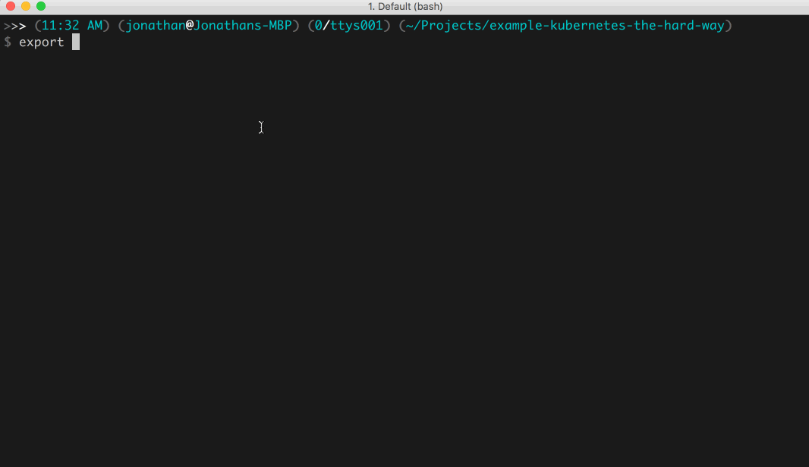

Generate certificates with [cfssl](https://github.com/cloudflare/cfssl).

* Homebrew (brew) is an OSX package manager that can be found [here](http://brew.sh/).

```
brew install cfssl
cd ssl
cfssl gencert -initca ca-csr.json | cfssljson -bare ca
cfssl gencert -ca=ca.pem -ca-key=ca-key.pem -config=ca-config.json -profile=kubernetes kubernetes-csr.json | cfssljson -bare kubernetes
```

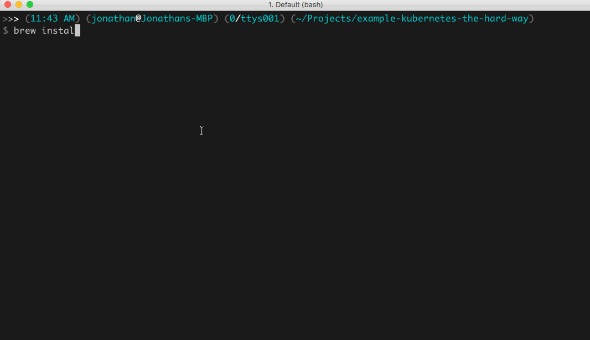

Stash the certificates and token.

* Feel free to change the token from `chAng3m3` to something else.

```
credstash -r us-west-2 put ssl/ca.pem @ca.pem -v 1
credstash -r us-west-2 put ssl/kubernetes-key.pem @kubernetes-key.pem -v 1
credstash -r us-west-2 put ssl/kubernetes.pem @kubernetes.pem -v 1
credstash -r us-west-2 put ssl/token chAng3m3 -v 1
cd ..
```

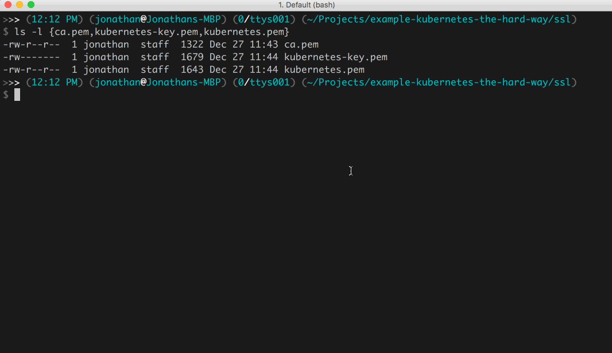

Generate an OpenSSH keypair.

```
aws ec2 create-key-pair --key-name kubernetes --region us-west-2 | \
  jq -r '.KeyMaterial' > ~/.ssh/kubernetes
chmod 600 ~/.ssh/kubernetes
ssh-add ~/.ssh/kubernetes
```

Install [Fugue](https://fugue.co/users/register/). Find the AMI ID at the [Download Portal](https://download.fugue.co) and replace `<ami_id>` below.

```
fugue init <ami_id>
fugue install -y
```

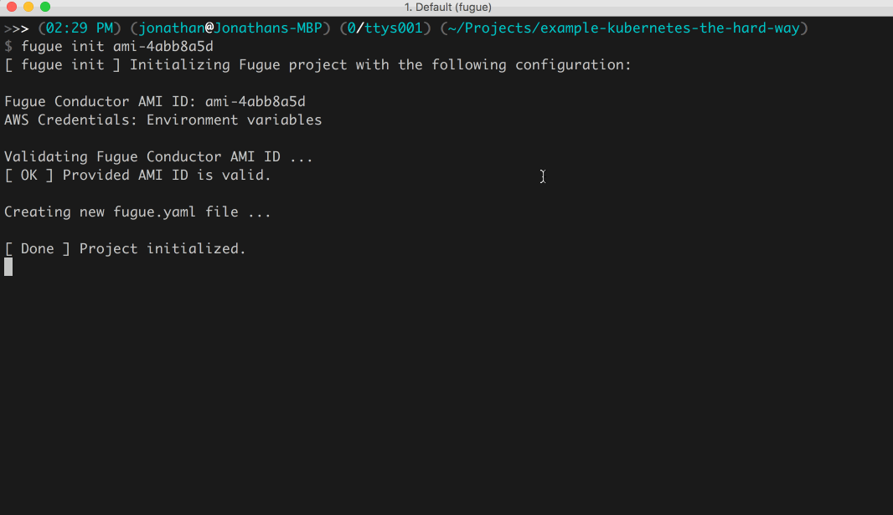

## Running the Composition

Run the compositions.

```
fugue run KubernetesTheHardWay.lw -a KubernetesTheHardWay
fugue run KubernetesAdmin.lw -a KubernetesAdmin
```

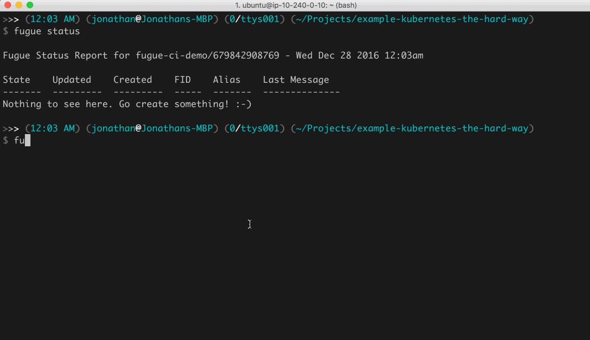

Once `fugue status` shows both processes have a `Last Message` of `SUCCESS`, we should have a fully deployed Kubernetes Cluster.  

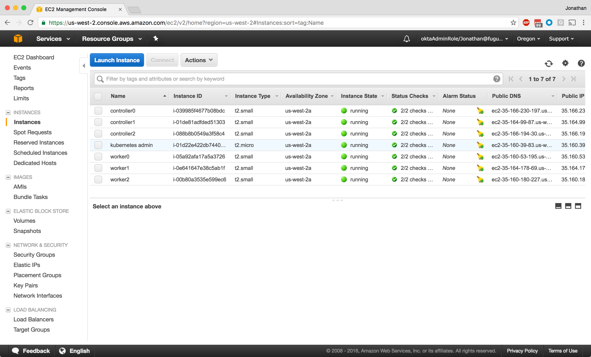

The Kubernetes cluster controller nodes have been configured with a TLS certificate that has the name `kubernetes` added to the list of valid [Subject Alternative Names](https://en.wikipedia.org/wiki/Subject_Alternative_Name).  By ensuring the name used to connect to our Kubernetes cluster matches this configuration, we can skip adding in the dynamically assigned `KUBERNETES_PUBLIC_ADDRESS` name as was done in the original instructions.  The Kubernetes Admin composition has a special [DhcpOptions](https://docs.fugue.co/Fugue.AWS.EC2.DhcpOptions.html#module-fugue-aws-ec2-dhcpoptions) configuration that sets the DNS search path to `example.com`.  When the Kubernetes Admin instance does a DNS lookup for the name `kubernetes`, it's going to use the search path and attempt to look up `kubernetes.example.com`, which will point to our Kubernetes ELB. This lets us automate the client setup as you'll see below.

In order to accomplish this, we need to create a private hosted zone for `example.com` and add a DNS [CNAME](https://docs.fugue.co/Fugue.AWS.Route53.ResourceRecordSet.CNAME.html#module-fugue-aws-route53-resourcerecordset-cname) record to point the name `kubernetes` at the dynamic name assigned to the ELB with Fugue.  Fugue has limited support for Route53 at the moment, so we have to create the private hosted zone out of band.  Check back soon for the updated Route53 functionality we have in the works.

Manually create the Private DNS Hosted Zone and export the Hosted Zone ID.

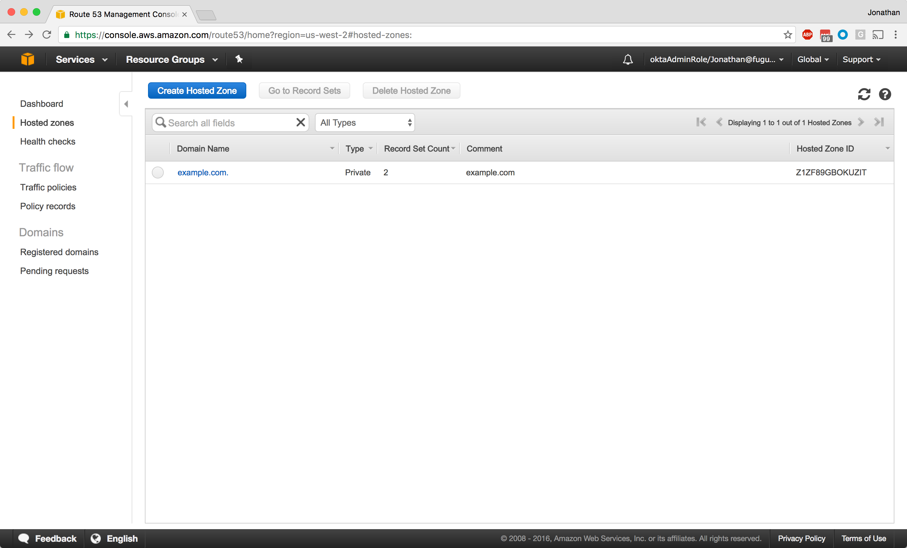

```
export ZONEID=Z1ZF89GBOKUZIT
```

Manually associate the Private DNS Hosted Zone with the Kubernetes Admin VPC.

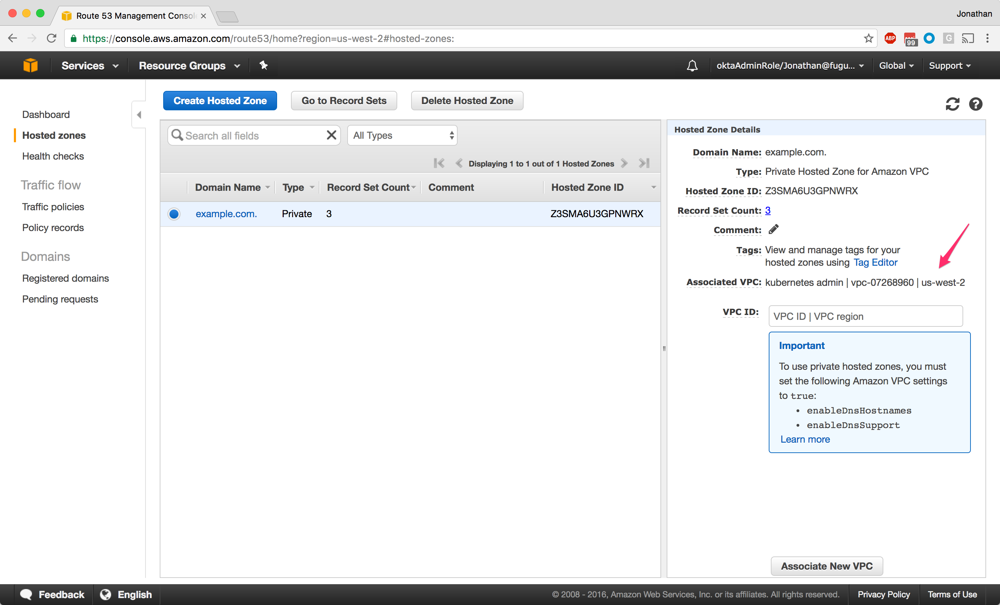

We're done with the manual steps. Now, we're going to configure DNS for the Kubernetes Admin instance with Fugue. We have only two record sets now, as you can see:

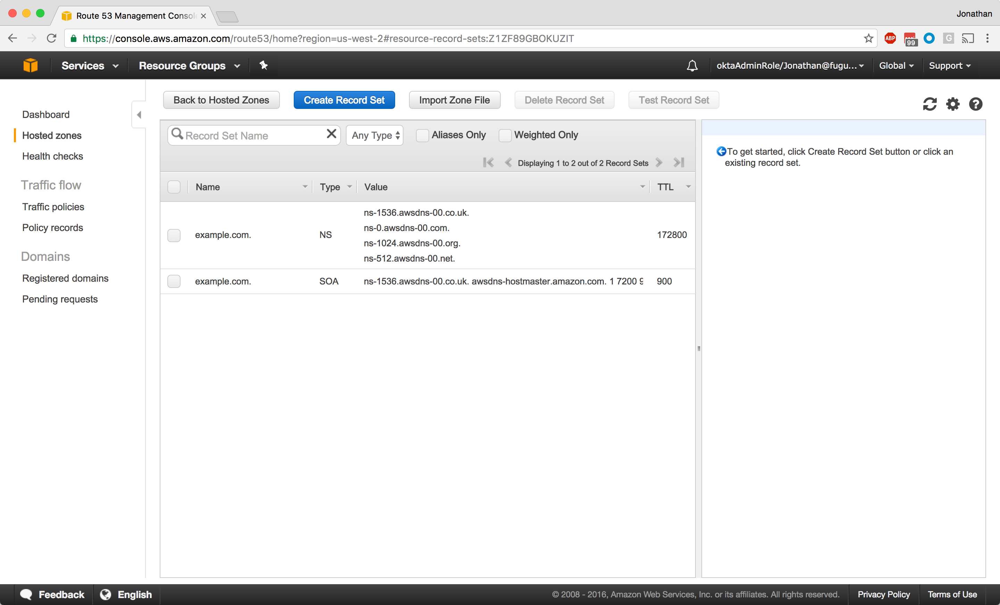

Create a DNS alias for `kubernetes.example.com` by running the `KubernetesDNS.lw` composition. The DNS record will point to the name the ELB created when we ran the first composition. 

```
export ELBNAME=$(fugue status KubernetesTheHardWay | \
 jq -r '.resources.loadBalancers | .[].value.loadBalancer.DNSName')
fugue run KubernetesDNS.lw -a KubernetesDNS
``` 

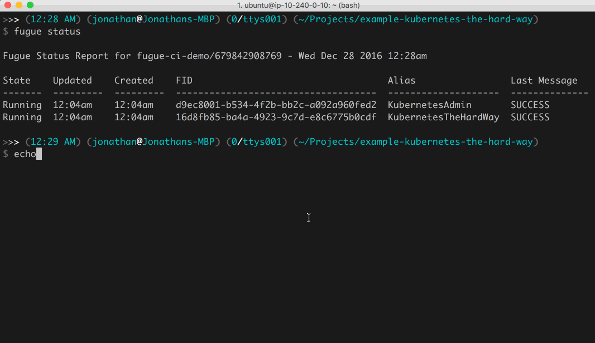

You can see Fugue has updated our hosted zone with a new CNAME record that points to our ELB name.

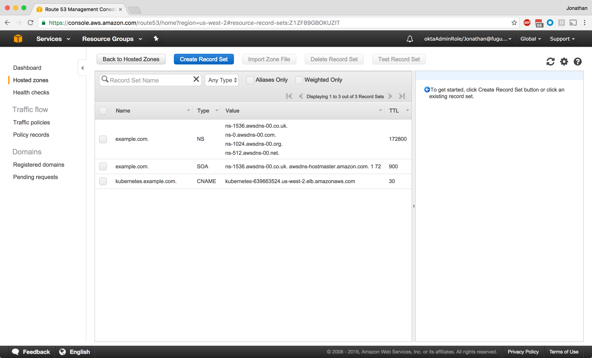

Get the public IP address of the admin instance.

```
ADMIN_INSTANCE=$(fugue status KubernetesAdmin | \
 jq -r '.resources.instances | .[].value.instance.PublicIpAddress')
```

## Verifying Results

SSH into the admin instance and make sure the name `kubernetes` resolves.

```
ssh -l ubuntu $ADMIN_INSTANCE
host kubernetes
kubectl get componentstatuses
kubectl get nodes
```

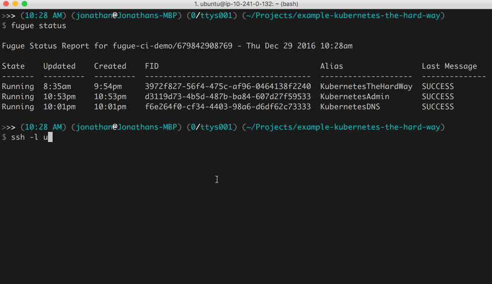

Deploy an `nginx` container to our Kubernetes cluster and expose the deployment so we can connect to the nginx service.

```
kubectl run nginx --image=nginx --port=80 --replicas=3
kubectl get pods -o wide
kubectl expose deployment nginx --type NodePort
kubectl get svc nginx --output=jsonpath='{range .spec.ports[0]}{.nodePort}'
```

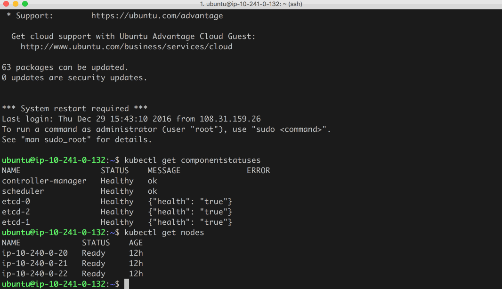

Record the port returned by the previous command, `32373`.

Fugue actively manages the running workloads in AWS, which includes enforcing security group rules.  So let's update our Kubernetes cluster's security group to allow inbound access to the port we just exposed and try to connect to it.

Edit the `KubernetesTheHardWay.lw` composition and add the following line to the `kubSg` security group.

* Note: Make sure it ends with a comma `,` if it's not the last ipPermission definition.

```
EC2.IpPermission.tcp(32373, EC2.IpPermission.Target.all)
```

Save the composition and then update the running workload with `fugue update`.

```
fugue update -y KubernetesTheHardWay KubernetesTheHardWay.lw 
```

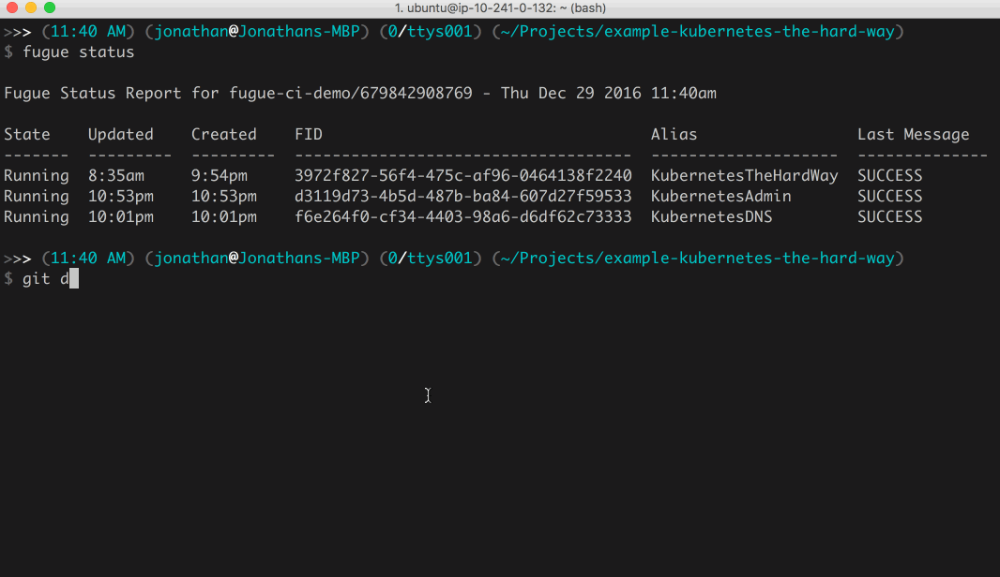

The `kubernetes` security group should now be updated to allow inbound access to the port we exposed in the previous steps.

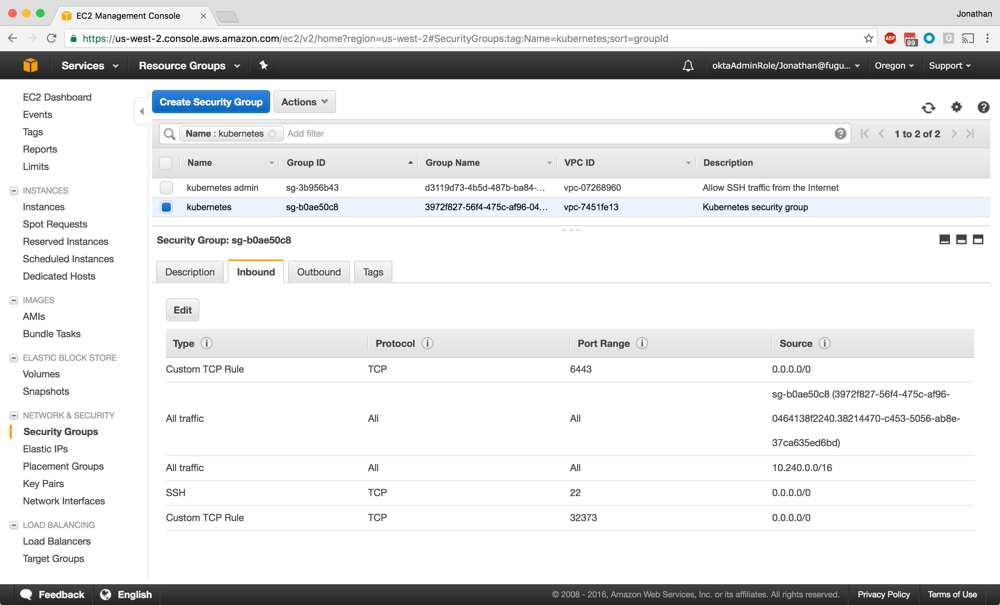

Get the Public IP Addresses of the worker nodes.

```
fugue status KubernetesTheHardWay |
  jq -r '.resources.instances[] |
  select(.value.instance.Tags[].Value | contains("worker")) |
  .value.instance.PublicIpAddress'
```

Let's open up a browser and connect to our nginx service on the worker node with ip `35.160.53.195` on node port `32373`.
* Note: Your IP address and node port will probably be different.

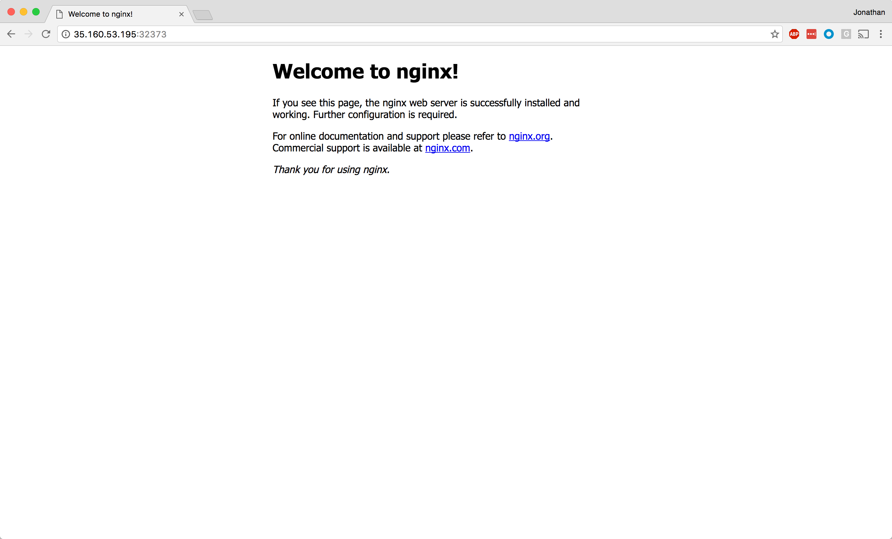

## Shutting It Down

On the Kubernetes Admin instance delete the nginx deployment and service and then exit out to clean up the Fugue processes.

```
kubectl delete deployment nginx
kubectl delete service nginx
```

When you're all done with the example, kill the running processes with `fugue kill`.

```
fugue kill -y KubernetesAdmin
fugue kill -y KubernetesDNS
fugue kill -y KubernetesTheHardWay
```

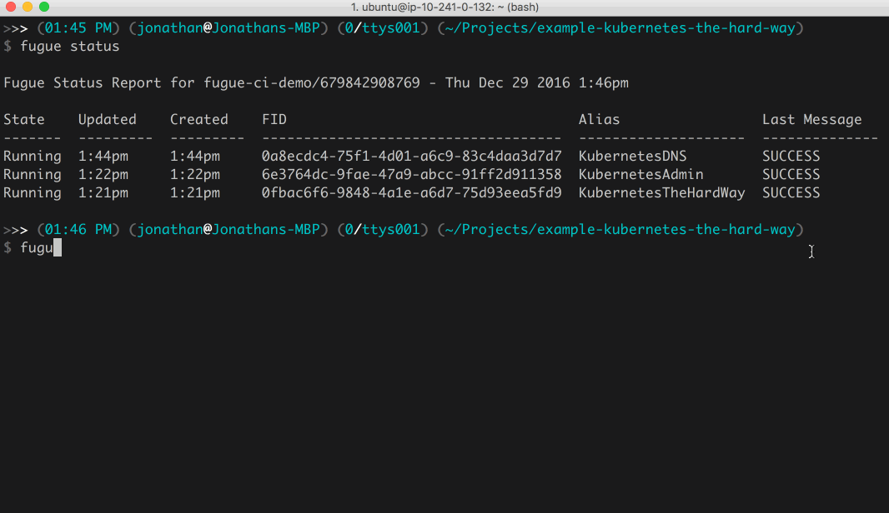

# Further Reading

[Kubernetes: Up and Running](http://shop.oreilly.com/product/0636920043874.do)
