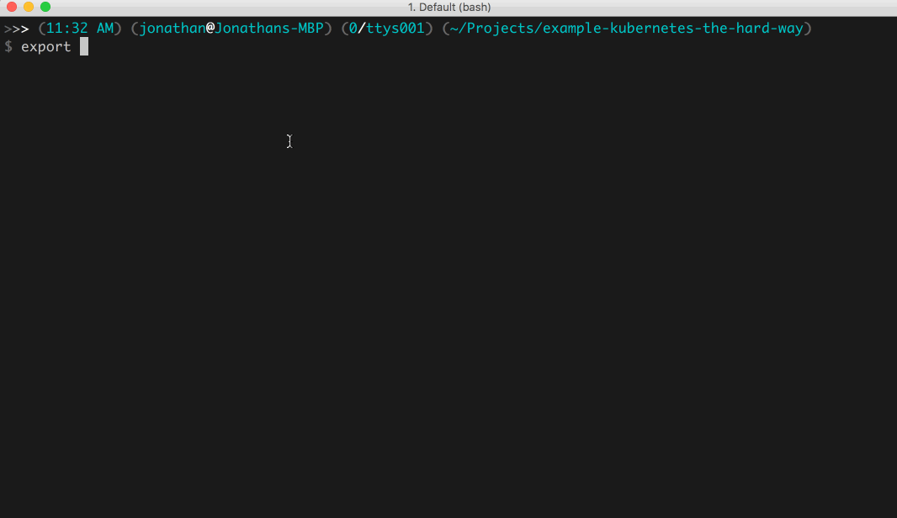
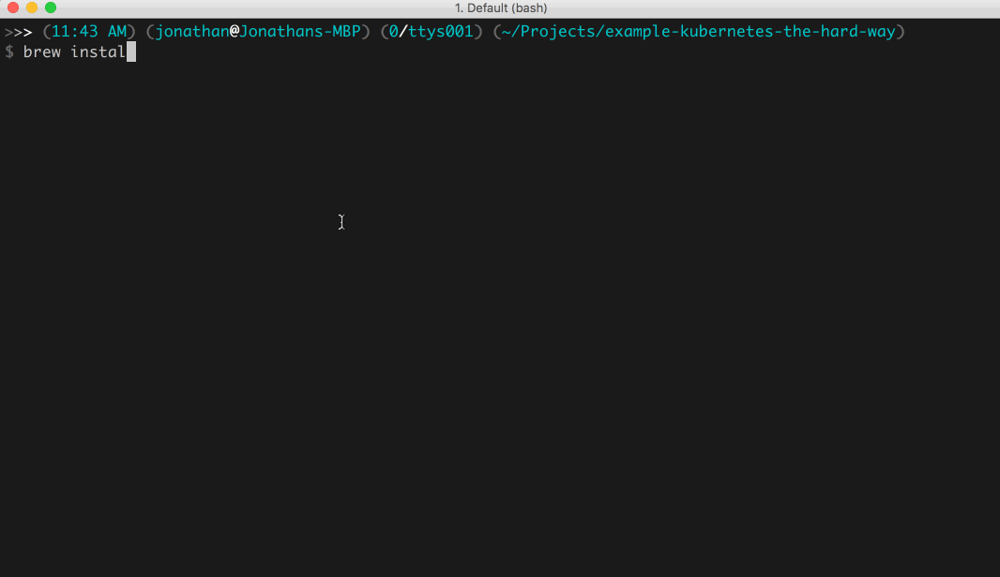
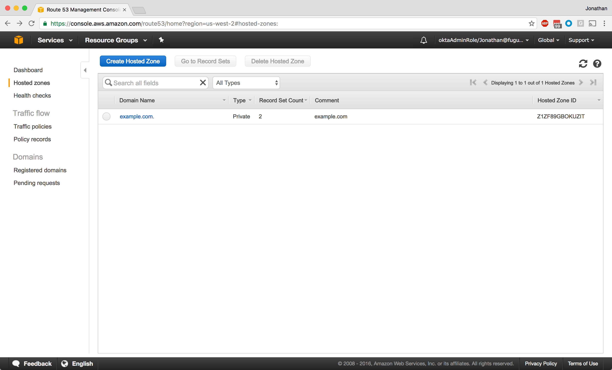
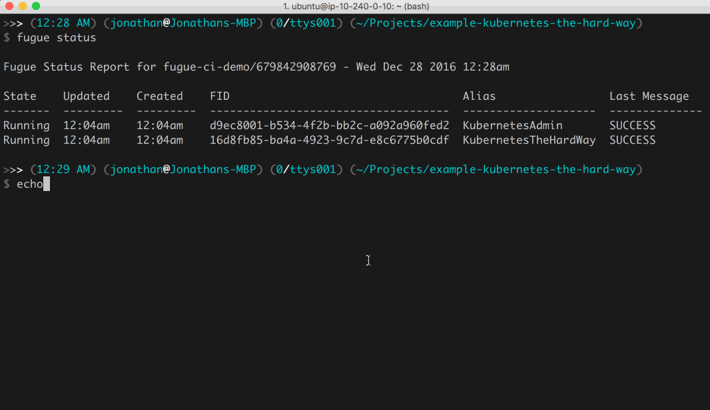
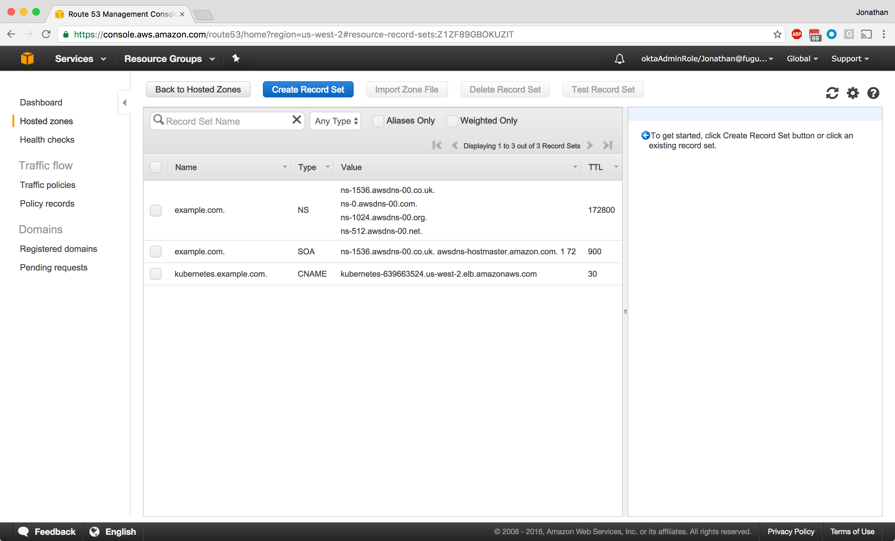

# example-kubernetes-the-hard-way

# Overview

## About This Example

This example demonstrates building a Kubernetes cluster much like the previous example, except this time we're going to hide all the complexity of creating a "Kubernetes The Hard Way" cluster in a Ludwig library.  In addition, we're also going to take the Kubernetes AWS integrations for a spin.

The Kubernetes API server, controller manager, and kubelet can all be configured with the `--cloud-provider` option.  We set this to `--cloud-provider=aws` via instance user-data.  This enables Kubernetes to dynamically add routes between pods so containers have connectivity across pods.  It will also set up Elastic Load Balancers and configure security group rules to allow inbound access to services running on the cluster.

If you've already gone through the prerequisites, skip down to the [Running the Composition](#running-the-composition) part.

## Prerequisites
* Obtain an AWS IAM user with an `AdministratorAccess` policy applied.
* Obtain the Fugue Client Tools [here](https://fugue.co/users/register/). *Note:* This example was tested with Fugue CLI Version: 1.0.3-2016.

# Usage

The following instructions are intended for OSX.

## Setup

Install [credstash](https://github.com/fugue/credstash)

Set up an encryption key called `credstash` in KMS (found in the IAM console).

Please see the official instructions [here](https://github.com/fugue/credstash#setting-up-kms)

* Note: Make sure you've created your `credstash` KMS key in the correct region.

Credstash will be used to securely store and distribute our certificates and secrets to the cluster nodes.

```
pip install credstash
credstash -r us-west-2 setup
```



Generate certificates with [cfssl](https://github.com/cloudflare/cfssl)

* Homebrew (brew) is an OSX package manager that can be found [here](http://brew.sh/)

```
brew install cfssl
cd ssl
cfssl gencert -initca ca-csr.json | cfssljson -bare ca
cfssl gencert -ca=ca.pem -ca-key=ca-key.pem -config=ca-config.json -profile=kubernetes kubernetes-csr.json | cfssljson -bare kubernetes
```



Stash the certificates and token.

```
credstash -r us-west-2 put ssl/ca.pem @ca.pem -v 1
credstash -r us-west-2 put ssl/kubernetes-key.pem @kubernetes-key.pem -v 1
credstash -r us-west-2 put ssl/kubernetes.pem @kubernetes.pem -v 1
credstash -r us-west-2 put ssl/token chAng3m3 -v 1
cd ..
```


Generate an SSH keypair.

```
aws ec2 create-key-pair --key-name kubernetes | \
 jq -r '.KeyMaterial' > ~/.ssh/kubernetes
chmod 600 ~/.ssh/kubernetes
ssh-add ~/.ssh/kubernetes
```

Install [Fugue](https://fugue.co/users/register/). Find the AMI ID at the [Download Portal](https://download.fugue.co) and replace `<ami_id>` below.

```
fugue init <ami_id>
fugue install -y
```

## Running the Composition

Run the compositions.

```
fugue run KubernetesWithAWSIntegrations.lw -a KubernetesWithAWSIntegrations
fugue run KubernetesAdmin.lw -a KubernetesAdmin
```


We should now have a fully deployed Kubernetes Cluster.


The Kubernetes cluster controller nodes have been configured with a TLS certificate that has the name `kubernetes` added to the list of valid [Subject Alternative Names](https://en.wikipedia.org/wiki/Subject_Alternative_Name).  By ensuring the name used to connect to our Kubernetes cluster matches this configuration, we can skip adding in the dynamically assigned `KUBERNETES_PUBLIC_ADDRESS` name as was done in the original instructions.  The Kubernetes Admin composition has a special [DhcpOptions](https://docs.fugue.co/Fugue.AWS.EC2.DhcpOptions.html#module-fugue-aws-ec2-dhcpoptions) configuration that sets the DNS search path to `example.com`.  When the Kubernetes Admin instance does a DNS lookup for the name `kubernetes`, it's going to use the search path and attempt to look up `kubernetes.example.com`, which will point to our Kubernetes ELB. This lets us automate the client setup as you'll see below.

In order to accomplish this, we need to create a private hosted zone for `example.com` and add a DNS [CNAME](https://docs.fugue.co/Fugue.AWS.Route53.ResourceRecordSet.CNAME.html#module-fugue-aws-route53-resourcerecordset-cname) record to point the name `kubernetes` at the dynamic name assigned to the ELB with Fugue.  Fugue has limited support for Route53 at the moment, so we have to create the private hosted zone out of band.  Check back soon for the updated Route53 functionality we have in the works.

Manually create the Private DNS Hosted Zone and export the Hosted Zone ID.

```
export ZONEID=Z1ZF89GBOKUZIT
```



Manually associate the Private DNS Hosted Zone with the Kubernetes Admin VPC.


We're done with the manual steps. Now, we're going to configure DNS for the Kubernetes Admin instance with Fugue. We have only two record sets now, as you can see:


Create a DNS alias for `kubernetes.example.com` by running the `KubernetesDNS.lw` composition.  The DNS record will point to the name the ELB created when we ran the first composition.

```
export ELBNAME=$(fugue status KubernetesWithAWSIntegrations | \
 jq -r '.resources.loadBalancers | .[].value.loadBalancer.DNSName')
fugue run KubernetesDNS.lw -a KubernetesDNS
```



You can see Fugue has updated our hosted zone with a new CNAME record that points to our ELB name.



Get the public IP address of the admin instance.

```
ADMIN_INSTANCE=$(fugue status KubernetesAdmin | \
 jq -r '.resources.instances | .[].value.instance.PublicIpAddress')
```

In order to take advantage of the Kubernetes AWS integrations, we have to tell Fugue to stop enforcing the `KubernetesWithAWSIntegrations` workload.  Otherwise, when Kubernetes creates load balancers and security group rules to give you access to your container services, Fugue is just going to remove them as you can see below.


We can disable `enforcement` by [suspending](https://docs.fugue.co/cli_suspend.html) the [process](https://docs.fugue.co/user-guide-process-model.html).  This will allow Kubernetes to make changes in AWS without Fugue trying to help.

```
fugue suspend -y KubernetesWithAWSIntegrations
```


## Verifying Results

SSH into the admin instance, make sure the name `kubernetes` resolves, and deploy an `nginx` container to our Kubernetes cluster.

```
ssh -l ubuntu $ADMIN_INSTANCE
host kubernetes
kubectl get componentstatuses
kubectl get nodes
kubectl run nginx --image=nginx --port=80 --replicas=3
kubectl get pods -o wide
```


If you take a look at the KubernetesWithAWSIntegrations composition, you'll see we have given our [Network](https://docs.fugue.co/Fugue.AWS.Pattern.Network.html) some custom tags.  When we deploy nginx across our three pods, the Kubernetes AWS integrations will try and locate a route table that's been tagged with `Name=KubernetesCluster,Value=<clusterid>`.  


Kubernetes will locate the route table and add routes between the pods.


OK, let's expose our `nginx` deployment so we can connect to it.  This time, instead of using the using `--type=NodePort`, we're going to use `--type=LoadBalancer`.  Kubernetes will set up an ELB and security group rules, and add the nodes to the load balancer, giving us everything we need to access the `nginx` service from home.

```
kubectl expose deployment nginx --type=LoadBalancer
kubectl get service -o wide
```


We'll see Kubernetes has set up the security group rules and the ELB for us.


## Shutting It Down

On the Kubernetes Admin instance, delete the nginx deployment and service and then exit out to clean up the Fugue processes.

```
kubectl delete deployment nginx
kubectl delete service nginx
```

When you're all done with the example, kill the running processes with `fugue kill`.

```
fugue kill -y KubernetesAdmin
fugue kill -y KubernetesDNS
fugue kill -y KubernetesWithAWSIntegrations
```


# Further Reading

[Kubernetes: Up and Running](http://shop.oreilly.com/product/0636920043874.do)
